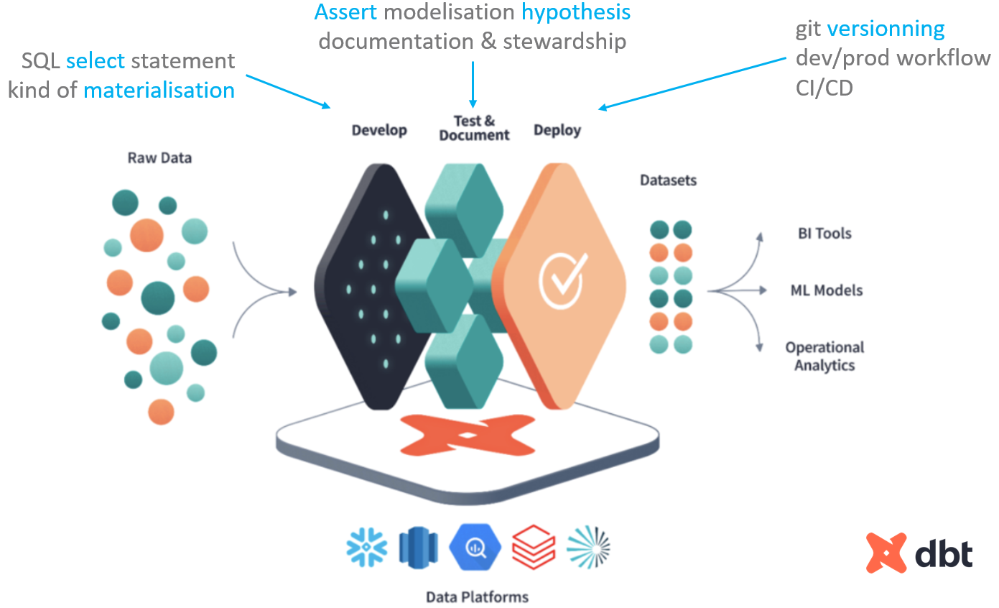

# Dataform Hypermarche

Same as [dbt_hypermarche](https://github.com/AntoineGiraud/dbt_hypermarche) but with [Dataform](https://github.com/dataform-co/dataform) made for BigQuery

## Dataform in GCP

**No local install** required 😊

### Set-up (cf. [GCP quickstart](https://cloud.google.com/dataform/docs/quickstart-create-workflow?hl=fr))
1. Dataform IAM roles
   - Dataform Admin (roles/dataform.admin) - for repository setup (git ...)
   - Dataform Editor (roles/dataform.editor) - workspaces and workflow invocations
2. Create a Dataform repository in [Dataform in GCP](https://console.cloud.google.com/bigquery/dataform)
3. Create and initialize a Dataform development workspace (~ git branch)
4. Create some table & views (you can execute them as if you where executing sql queries in BigQuery IDE)
5. Grant BigQuery access to dataform service account
6. 1st dev deployment/materialisation
7. *Have buisness/partner to review the data*
8. [Connect to distant git repo](https://cloud.google.com/dataform/docs/connect-repository?hl=fr)
    - Note: if using ssh ... in ssh params > public host key ... it's the one from Github, Gitlab ... note yours ...
9.  Push branch (or to master if lazy)
10. Configure prod version (daily git clone) & workflow (daily dataform run)

## Dataform's CLI

### Install & set-up

cf. GCP doc [use-dataform-cli](https://cloud.google.com/dataform/docs/use-dataform-cli)

1. install [node js](https://nodejs.org/en/download) & npm
2. install dataform `npm i -g @dataform/cli`
3. `dataform init-creds` to your BigQuery
    - choose your region
    - choose credential type : ADC (Application Default Credentials) or json key
4. if new project, in a new directory : `dataform init . GCP_PROJECT DEFAULT_LOCATION`
    - will init bare dataform files/folders

### Useful cli commands

- `dataform --help` to check available options
- `dataform compile` to check repo validity
- `dataform run --dry-run` to check sql validity with BigQuery without materialisation
- `dataform run --schema-suffix cli_demo` to suffix materialized schema (ex: cicd tests)
- `dataform run --actions stg_commande --actions stg_retour_commande` materialize those 2 models
- `dataform run --actions stg_commande --include-deps` equivalent to `dbt run +stg_commande`
- `dataform run --actions stg_commande --include-dependents` equivalent to `dbt run stg_commande+`
- `dataform compile --json > dataform_compiled.json` to export project lineage, queries ...

### Ideas of CICD deployment

- [karcot1/dataform_deployment_sample](https://github.com/karcot1/dataform_deployment_sample)
- other [dataform examples](https://github.com/dataform-co/dataform?tab=readme-ov-file#example-projects)

## dbt VS Dataform

### Same concepts

- data analyst takes care of `select` statement
- dbt & dataform materialises it *(table, view...)* in the Data Warehouse *(DDL/DML)*
- 1 select = 1 node / model / definition
- lineage is infered automatically with `ref('ancestor_table')` function
- documentation is to be done in the tool
- data tests can be added to help assert modelisation hypothesis
  - generic tests : `unique`, `not_null`, ...
  - custom tests : `select` statement filtering rows in error
- you can do macro/functions to help generate sql & ease Data Analyst life #devExperience #selfServedAnalyst

### Some high level differences

|  | dbt | dataform |
|-----|----------|-----|
| **Birth** | 2016 | 2018 |
| **Warehouse** | Many DWH supported | **BigQuery only** |
| **Community** | massive | niche |
| **Extensions** | many | few |
| **Github** | [dataform-co/dataform](https://github.com/dataform-co/dataform) | [dbt-labs/dbt-core](https://github.com/dbt-labs/dbt-core) |

### Some technical differences

|  | dbt | dataform |
|-----|----------|-----|
| **files** | 1 .sql  1 .yml *(tests & doc)* | 1 .sqlx |
| **hook** | `{{config( post_hook=["sql1", …] )}}` | `post_operations{ sql1; sql2; }` |
| **macro** | jinja (python) `{{my_function()}}` | javascript `${my_function()}` |
| **macro run_query** | **yes** | **no** -mitigate with sql scripting |
| **custom materialisation** | **yes** | **no** - mitigate with sql scripting & operation node `config{hasOutput:true}` |
| **cli** | `dbt build -s my_table+ my_second_table+` | `dataform run --actions my_table --actions my_second_table --include-dependents` |
| **defer** | `dbt build -s my_table+ --defer --state path/to/artifacts` | **no defer** to production  mitigate with schema clone as view ? |
| **run modified** | `dbt ls --select "state:modified" --state path/to/artifacts` | no option to run only modified files |
| **fine selection** | `dbt build -s my_table+1 my_second_table` | no fine DAG selection yet or filter only on compile graph |
| **assertion** | **errors** by default | **warns** by default  mitigate with `post_operations{ assert( 0=(select count(1)) ) as "error xxx" }`   |
| **control assertion severity** | fine control on assert severity (warn or error) | assert severity as error from children nodes one by one with config `dependOnDependencyAssertions:true` |
| **python** | yes | not quite yet |

#### Syntax differences

### How to choose & alternatives

Either ways, DO monitor your BigQuery spending (queries)
Masthead can help you

- [SQL Mesh](https://github.com/TobikoData/sqlmesh) - Based on [SQL Glot](https://github.com/tobymao/sqlglot) 😎
- [SDF](https://github.com/sdf-labs/sdf-cli) - Semantic Data Framework

